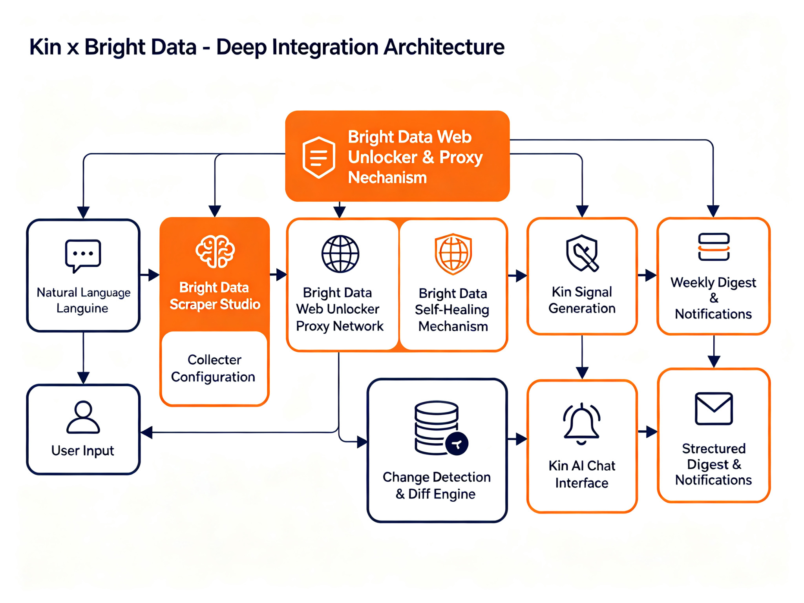
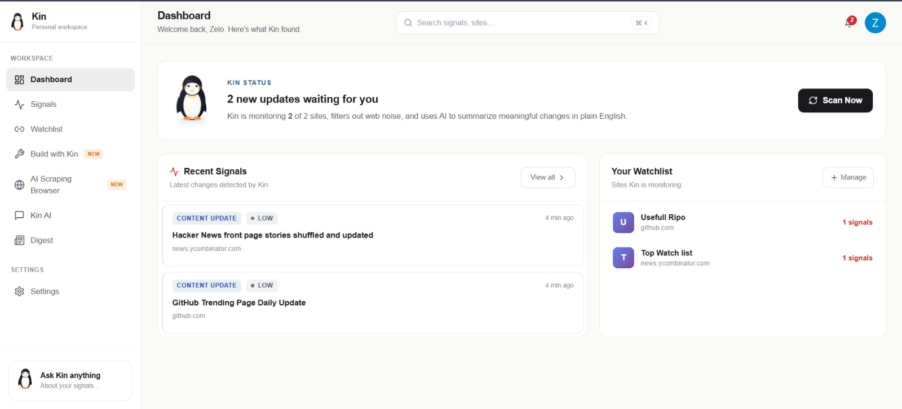
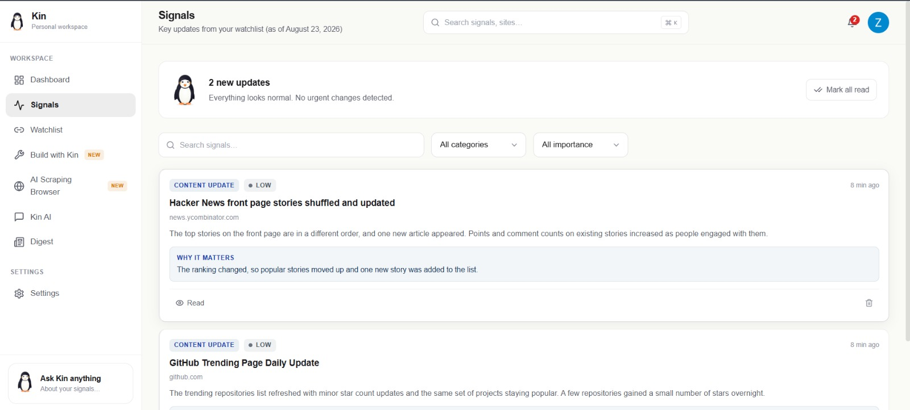
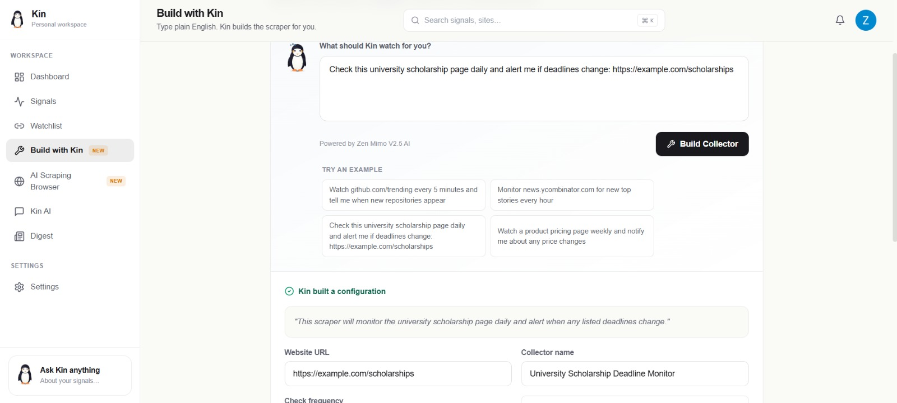
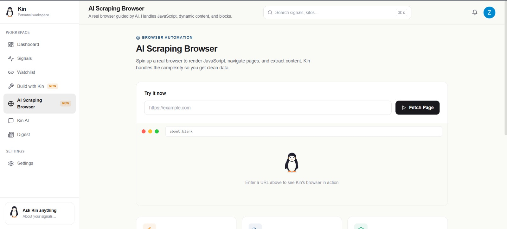
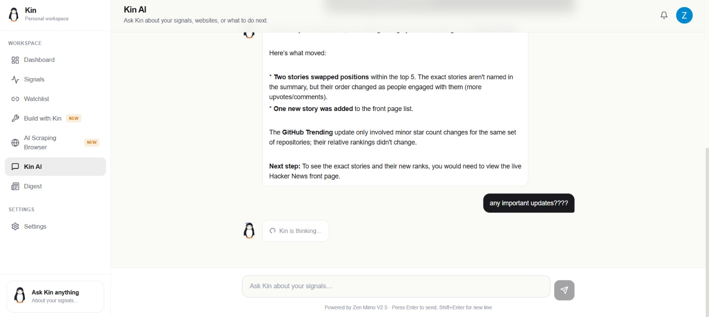
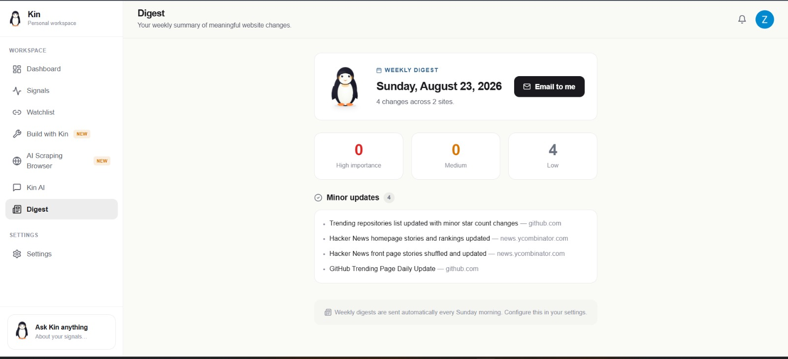

<div align="center">

# Kin

### Know what changes on the web.

**Built on Bright Data infrastructure** 

[](https://kinbrightdata.vercel.app/)
[](https://github.com/SuhasHanamannavar/Kin)
[](https://scrapeverse.dev/)
[](https://brightdata.com/)

</div>

---

## 🚀 Live Demo

Experience Kin live at **[kinbrightdata.vercel.app](https://kinbrightdata.vercel.app/)**


YouTube Demo: https://youtu.be/4T849NYJ-3A?is=MfgzTuvVm2ui7_og

The landing page features a cinematic, scroll-driven design with:
- 🕷️ Spider-Man themed hero with animated web strings
- 📊 Interactive dashboard preview
- 🎬 GSAP-powered scroll animations
- 🎥 Hackathon story video with subtitles
- 🐧 Kin the penguin character throughout

---

## Table of Contents

- [Overview](#overview)
- [Architecture](#architecture)
- [Features](#features)
- [Bright Data Integration](#bright-data-integration)
- [Screenshots](#screenshots)
- [Judging Criteria](#judging-criteria)
- [Technical Stack](#technical-stack)
- [Getting Started](#getting-started)
- [Project Structure](#project-structure)
- [Security](#security-and-user-isolation)
- [License](#license)

---

## Overview

Kin monitors websites and tells you when something meaningful happens. Instead of flooding users with raw HTML differences, it uses Bright Data to extract reliable data, then applies language models to translate changes into plain English.

Most website updates are noise — advertisements, timestamps, minor interface tweaks. Kin filters that out. Users describe what they want to watch in plain English, and Kin handles the rest: building collectors, scheduling runs, detecting changes, and summarizing what matters.

---

## Architecture



### Data Flow

1. User describes a monitoring task in plain English
2. Kin's language layer parses the intent — URL, frequency, and key elements
3. Kin calls the Bright Data Collector API to create a real collector
4. Bright Data's Web Unlocker fetches pages through its global proxy network
5. Bright Data's self-healing infrastructure maintains collector reliability
6. Structured data returns to Kin for analysis
7. Kin hashes content and runs change detection
8. Important changes become signals with plain-English summaries
9. Users can chat with Kin about their data through the AI interface
10. Weekly digests compile changes for email delivery

---

## Features

### Build with Kin — Natural Language to Collector

Users type what they want. Kin builds the scraper.

- Plain English input: "Check this university scholarship page daily and alert me if deadlines change"
- Language model parses intent into collector configuration
- Real collectors created in Bright Data, visible in both Kin and Bright Data dashboards
- Each user gets independent collectors, isolated from other accounts

### Website Monitoring

- Add URLs to a watchlist with custom categories and scan frequencies
- All scraping routes through Bright Data first for reliability
- Content hashing detects changes between scans
- Semantic analysis distinguishes meaningful updates from noise

### Signals

- Changes classified by importance: High, Medium, Low
- Plain English summaries instead of technical diffs
- Each signal includes context on why the change matters
- Search, filter, and mark signals as read

### Kin AI Chat

- Ask questions about monitored data in natural language
- Responses grounded in actual watchlist and signal history
- Built on Zen Mimo V2.5 with Groq fallback

### Weekly Digest

- Automated summary delivered every Sunday morning
- Changes grouped by importance level
- On-demand digest generation available

### AI Scraping Browser

- Full Chromium environment for JavaScript-heavy sites
- Handles single-page applications, lazy loading, and dynamic content
- Protected by Bright Data's anti-blocking infrastructure

---

## Bright Data Integration

Bright Data forms the foundation of Kin's data acquisition layer. Every scraping operation in Kin routes through Bright Data first.

### Integration Points

| Component | How Kin uses Bright Data | Code Location |
|---|---|---|
| Collector Management API | Creates, runs, queries, and deletes collectors programmatically | `lib/brightdata.ts` |
| Web Unlocker | Primary fetch mechanism for all watchlist URLs — proxies, CAPTCHA solving, anti-blocking | `lib/brightdata.ts` — `fetchViaBrightData()` |
| Scraper Studio | Language model translates natural language into collector configurations | `app/api/build-scraper/route.ts` |
| Self-Healing | Bright Data infrastructure automatically repairs selectors when sites change | Platform-level feature |
| Global Proxy Network | Residential and data center proxies across 195+ countries | Configured through Web Unlocker zone |
| Dual Visibility | Collectors appear in both Kin and Bright Data dashboards | Collector API integration |
| Graceful Fallback | Direct HTTP fetch used only in development without Bright Data credentials | `lib/scraper.ts` — `fetchPageContent()` |

### Code Examples

#### Creating a Collector
```typescript
// Creates a real collector in Bright Data, visible in both dashboards
export async function createBrightDataCollector(config) {
  const payload = {
    name: config.name,
    type: 'unblocker',
    configuration: {
      url: config.url,
      format: 'json',
      extract: {
        title: 'h1',
        content: 'body',
        custom_elements: selectors
      },
      schedule: {
        frequency: mapFrequencyToBrightData(config.frequency)
      }
    }
  };

  return fetch(`${BRIGHTDATA_API_BASE}/collectors`, {
    method: 'POST',
    headers: { Authorization: `Bearer ${BRIGHTDATA_API_KEY}` },
    body: JSON.stringify(payload)
  });
}
```

#### Priority-Based Scraping
```typescript
// Bright Data first, direct fetch only as development fallback
export async function fetchPageContent(url) {
  if (isBrightDataEnabled()) {
    const result = await fetchViaBrightData(url);
    if (result.success && result.html) {
      return { ...result, source: 'brightdata' };
    }
  }
  return directFetch(url); // Development fallback only
}
```

### API Routes That Use Bright Data

- `POST /api/scrape` — Watchlist URL scraping
- `POST /api/build-scraper` — Natural language to collector creation
- `GET /api/collectors` — Collector status management
- `DELETE /api/collectors` — Collector removal
- `POST /api/scrape-browser` — Browser-based scraping
- `POST /api/signals` — Signal generation from scraped data

---

## Screenshots

### Dashboard


### Signals


### Build with Kin


### AI Scraping Browser


### Kin AI Chat


### Weekly Digest


---

## Judging Criteria

### 1. Potential Impact

Kin addresses a real problem: information overload from constant website changes. Researchers, analysts, students, and competitive intelligence teams currently waste hours manually checking pages. The multi-tenant architecture scales to thousands of users, and the natural language interface lowers the barrier for non-technical users.

### 2. Creativity and Innovation

The natural language to collector pipeline removes the technical barrier to web scraping. Users do not need to know CSS selectors or scheduling logic. The penguin character, Kin, provides a memorable interface guide, and the dual dashboard integration means collectors exist as real Bright Data objects, not just database records.

### 3. Technical Excellence

The project uses Next.js 14 with TypeScript throughout. Authentication runs through Clerk with proper session management. Supabase PostgreSQL with Row Level Security stores user data. The library layer cleanly separates concerns, error handling covers all external API calls, and every API route validates authentication and scopes queries to the current user.

### 4. Use of Scraper Studio

Every "Build with Kin" request creates an actual Bright Data collector through the Collector Management API. The integration covers the full lifecycle: create, run, check status, and delete. The language model converts natural language into structured collector configurations with proper scheduling and extraction rules. Collectors appear in the Bright Data dashboard as well as in Kin.

### 5. Reliability and Self-Healing

Bright Data's Web Unlocker provides the global proxy network, CAPTCHA solving, and anti-blocking capabilities that make Kin reliable. The platform's self-healing infrastructure automatically maintains collectors when websites change. The code implements graceful degradation — if Bright Data is unavailable during development, a direct fetch fallback keeps the interface functional.

### 6. Presentation

The interface follows a clean, macOS-inspired design. This README documents every feature and integration point. Architecture diagrams and screenshots illustrate how the system works. All major features function end-to-end and are ready for demonstration.

---

## Technical Stack

| Layer | Technology | Purpose |
|---|---|---|
| Frontend | Next.js 14 (App Router), React 18, TypeScript | Application interface |
| Styling | Tailwind CSS | Design system |
| Authentication | Clerk | User management and sessions |
| Data Acquisition | Bright Data | Collector API, Web Unlocker, proxies, self-healing |
| Database | Supabase PostgreSQL | User data, watchlists, signals |
| Language Models | Zen Mimo V2.5, Groq fallback | Intent parsing, change analysis, chat |
| Email | Resend | Weekly digests and notifications |
| Icons | Lucide React | Consistent iconography |
| Deployment | Vercel | Production hosting |

---

## Getting Started

### Prerequisites

- Node.js 18 or later
- A Clerk account for authentication
- A Bright Data account for scraping infrastructure
- An OpenCode Zen API key for language model access
- A Supabase account for the database
- Resend account (optional) for email notifications

### Installation

```bash
git clone https://github.com/SuhasHanamannavar/Kin.git
cd Kin
npm install
cp .env.example .env.local
# Edit .env.local with your credentials
```

### Environment Variables

```env
# Clerk
NEXT_PUBLIC_CLERK_PUBLISHABLE_KEY=
CLERK_SECRET_KEY=

# Bright Data
BRIGHTDATA_API_KEY=
BRIGHTDATA_ZONE=

# OpenCode Zen
ZEN_API_KEY=

# Supabase
NEXT_PUBLIC_SUPABASE_URL=
NEXT_PUBLIC_SUPABASE_ANON_KEY=
SUPABASE_SERVICE_ROLE_KEY=

# Resend (optional)
# RESEND_API_KEY=

# Application
NEXT_PUBLIC_APP_URL=http://localhost:3000
```

### Database Setup

1. Create a Supabase project
2. Run the SQL schema from `supabase/schema.sql` in the Supabase SQL Editor
3. Add the connection details to `.env.local`

### Development

```bash
npm run dev
```

Open http://localhost:3000

### Production Build

```bash
npm run build
npm start
```

---

## Project Structure

```
Kin/
├── app/
│   ├── api/
│   │   ├── build-scraper/        # Natural language to collector
│   │   ├── chat/                 # AI chat interface
│   │   ├── collectors/           # Collector management
│   │   ├── digest/               # Weekly digest generation
│   │   ├── scrape-browser/       # Browser-based scraping
│   │   ├── scrape/               # Watchlist URL scraping
│   │   ├── settings/             # User settings
│   │   ├── signals/              # Signal operations
│   │   └── watchlist/            # Watchlist management
│   ├── app/                      # Protected application pages
│   │   ├── build/                # Build with Kin
│   │   ├── dashboard/            # Main dashboard
│   │   ├── digest/               # Weekly digest view
│   │   ├── kin/                  # AI chat interface
│   │   ├── scraping-browser/     # AI Scraping Browser
│   │   ├── settings/             # Settings
│   │   ├── signals/              # Signals list
│   │   └── watchlist/            # Watchlist management
│   ├── auth/                     # Clerk authentication pages
│   ├── layout.tsx
│   └── page.tsx                  # Landing page
├── components/
│   ├── layout/                   # AppShell, Sidebar, TopBar
│   └── ui/                       # Reusable UI components
├── lib/
│   ├── ai.ts                     # Language model integration
│   ├── auth-helper.ts            # Clerk auth utilities
│   ├── brightdata.ts             # Bright Data API wrapper
│   ├── db.ts                     # Database operations
│   ├── emails.ts                 # Email templates
│   ├── scraper.ts                # Scraping logic
│   └── utils.ts                  # Shared utilities
├── docs/
│   └── assets/
│       ├── architecture/         # System diagrams
│       └── screenshots/          # Product screenshots
├── styles/
│   └── globals.css
├── supabase/
│   └── schema.sql
├── types/
│   └── index.ts
├── .env.example
├── middleware.ts
├── next.config.js
├── package.json
├── tailwind.config.ts
└── tsconfig.json
```

---

## Security and User Isolation

Kin implements multiple layers of user isolation:

1. Every API route validates the Clerk session before processing
2. All database queries include user ID filtering
3. PostgreSQL Row Level Security policies enforce isolation at the database level
4. Each Bright Data collector belongs to exactly one user
5. No shared state exists between user accounts
6. Secrets live in environment variables, never in committed code

---

## Design

The interface uses a warm off-white background with deep charcoal text and soft rounded corners. Kin the penguin appears throughout the interface as an SVG character with multiple states: idle, thinking, scanning, building, found, happy, and error. Subtle animations and smooth transitions guide the user experience.

---

## License

MIT © 2026 Suhas Hanamannavar

---

<div align="center">

Built for Scrape-Verse Hackathon 2026

WeMakeDevs × Bright Data

</div>
